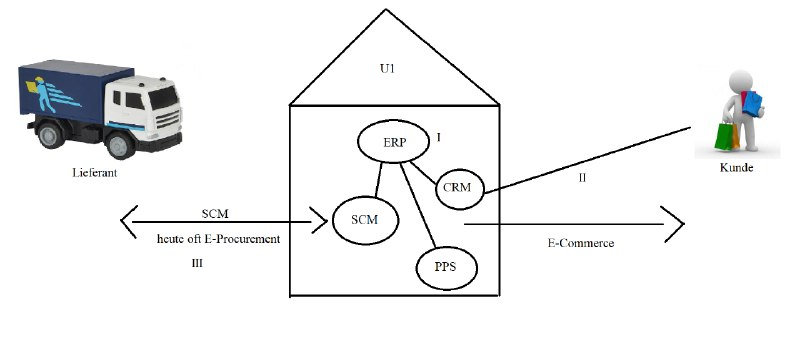

# Betriebliche Informationssysteme
=> sind große Systeme, die in Unternehmen zum Einsatz kommen.  

__Vorteile :__  
- __Service__ (wenn Fehler auftreten, dann ist irgendwer anderer Schuld/wer anderer haftet)
- __Managementebene__ (Daten müssen aufbereitet werden, Zielverfolgung muss ersichtlich sein (Solldaten - Istdaten)); In großen Unternehmen kann man solche Dinge nicht mehr auf Zettel schreiben (Bsp.: Bei Maschine xy muss Teil z ausgetauscht werden); Wo sind Engpässe im System

## Begriffe für Angeber
- __CRM (Customer Relationship Management)__ [Kundenbeziehungsmanagement]  
Marketing gezielt auf bestimmte Kunden (neue Angebote, maßgeschneiderte Werbung), Retourenmanagement, Kunden Aquirierung, Kundenstamm (Daten vom Kunden), Mitarbeiter ...  
- __ERP (Enterprise Ressource Planning__) [Unternehmensplanungsm.]  
    - Dynamics Nav (Microsoft) ... ehem. Navision [< 500 Mitarbeiter]  
    - Dynamics Ax ... ehem. Axapta [Großkunden > 500 Ma]  
    - SAP (Scheiß auf Privatleben)  
    - Oracle ERP  
    - Siebel
- __SCM (Supply Chain Management)__ [Lieferkettenmanagement]  
- __CMS (Content Management System)__ [Inhaltsmanagement]  
Artikel/Teile über Webshop verkaufen, Informationen über Artikel über Webseite verfügbar, ...  
- __E-Procurement__ (Elektronischer Einkauf/Beschaffung) 
- __E-Business__ (Elektronischer Handel "allgemein")  
- __E-Commerce__ (Elektronischer Vertrieb)  
- __DMS (Document Management System)__  
- __PPS (Production Planing System)__ [Produktions Planungs. und Steuerungssystem]  
Planung für Güter

## Beispiel
  
__I:__ Oft ist das ERP das Hauptsystem in das die übrigen Systeme integriert sind. (Module)  
__II:__ Das CRM bildet alle Vorgänge in Sachen Kunden ab. Das reicht vom Webshop (E-Commerce) über das Retourenmanagement (Reklamationen, ... also im weitesten Sinn die Kundenzufriedenheit, Aquisitor, Kundenbindung, ...)  
__III:__ SCM/E-Procurement