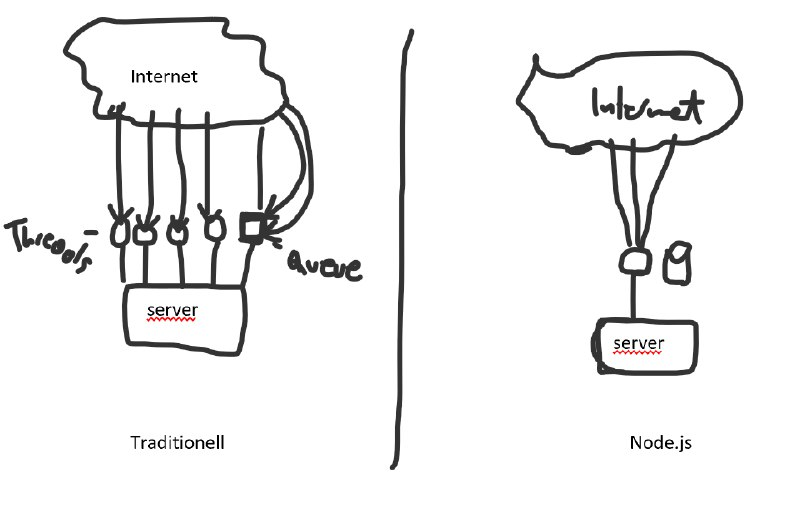

# NODE.js Mitschrift
- Traditionell:  
 wird der Server über Threads kontaktiert. Das ist für REST Webseiten, bei denen durchgehend irgendwelche kleine Abfragen gemacht werden tötlich, da für jede Abfrage immer der Thread blockiert wird.
 - Node.js:  
 Es gibt nur einen Thread. In diesem Thread ist eine kleine Queue drinnen, die nacheinander abgearbeitet wird. Alle Anfragen gelangen zu dem Thread.  
 Dieser Thread arbeitet __parallel__ die Tasks ab.  
 __Vorteile__: wenig RAM nötig, nur ein Thread



 Aktueller JavaScript Standard: es6
#### Variablen Deklarierung
Variablen müssen mit "var" deklariert werden. Ansonsten sind sie global. Wenn man dann in zwei verschiedenen Files die selbe Variable hat überschreiben sie sich. -> Man kann viel Blödsinn damit anstellen.

#### Verschiedene Funktionsdefinitionen:
```js
function add5(x){
    return x+5
}

var add10 = function(x){
    return x+10
}

var add15 = (x) => {
    return x+15
}

function execute(fun, wert){
    console.log("Ergebnis:"+fun(wert))
}
```
### Verschiedene Commands
__Datei aus Filesystem einlesen:__  
Mit require lädt man eine Library und weist sie einer Variable zu.
```js
const fs = require('fs')
```
Mit __Callbacks__ können solche Aufrufe dann gemacht werden, damit sie den Thread nicht blockieren.  
```js
fs.readFile('Hello.txt', (err,data) => {
    if(err) throw exception
    console.log(data.toString())
})
```
#### Funktionen in Funktionen zurückliefern
```js
function addFun(x,y){
    return () => {return "Ergebnis von der addFun: "+(x+y)}
}

var abc = addFun(1,2)
console.log(abc())
```
### Node Package Manager (npm)
```bash
npm init
npm install --save express
```